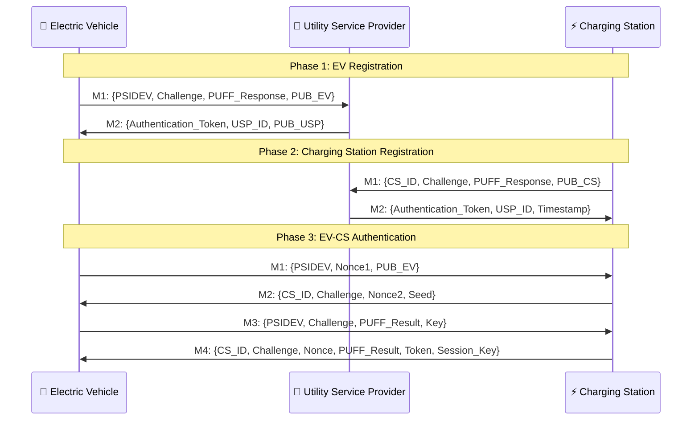

<div align="center">

# ⚡ SmartCharge-Auth ⚡

### Advanced EV Charging Network Simulation Platform


<p><b>⚙️ Securely simulate, authenticate, and analyze Electric Vehicle charging sessions with precision and elegance</b></p>


</div>

---

### 🌟 *Revolutionizing Electric Vehicle Authentication with PUFF Cryptography*

**SmartCharge-Auth** is a cutting-edge simulation platform that demonstrates secure communication protocols between Electric Vehicles (EVs), Charging Stations, and Utility Service Providers (USPs) using advanced PUFF (Physical Unclonable Function) cryptographic techniques.

[🚀 **Live Demo**](https://ev-stimulation.vercel.app/)

</div>

---

## 📸 **Visual Preview**

<div align="center">


</div>

---

## 🎯 **What is SmartCharge-Auth?**

SmartCharge-Auth is an **interactive web-based simulation platform** that models and analyzes the security protocols used in modern electric vehicle charging infrastructure. It provides:

### 🔐 **Security Focus**
- **PUFF Cryptography**: Physical Unclonable Function-based authentication
- **End-to-End Encryption**: All communications are encrypted
- **Multi-layer Authentication**: EV ↔ USP ↔ Charging Station verification

### 📊 **Real-time Analytics**
- **Performance Metrics**: Throughput, latency, success rates
- **Network Visualization**: Interactive topology with live message flows
- **Comparative Analysis**: Multi-simulation performance comparison

### 🎮 **Interactive Experience**
- **Configurable Parameters**: Adjust network size and simulation speed
- **Live Monitoring**: Watch protocols execute in real-time
- **Data Export**: Download charts and performance data

---

## ✨ **Key Features**

<table>
<tr>
<td width="50%">

### 🔒 **Advanced Security**
- ✅ **PUFF-based Authentication**
- ✅ **AES-256 Encryption**
- ✅ **Challenge-Response Protocol**
- ✅ **Digital Signatures**
- ✅ **Replay Attack Prevention**

### 📊 **Analytics & Monitoring**
- ✅ **Real-time Performance Metrics**
- ✅ **Interactive Charts & Graphs**
- ✅ **Network Topology Visualization**
- ✅ **Message Flow Tracking**
- ✅ **Statistical Analysis**

</td>
<td width="50%">

### 🎮 **User Experience**
- ✅ **Intuitive Web Interface**
- ✅ **Responsive Design**
- ✅ **Dark/Light Mode Support**
- ✅ **Export Functionality**
- ✅ **Multi-language Support**

### 🔧 **Technical Excellence**
- ✅ **TypeScript for Type Safety**
- ✅ **Modern React Architecture**
- ✅ **Optimized Performance**
- ✅ **Comprehensive Testing**
- ✅ **CI/CD Integration**

</td>
</tr>
</table>

---

## 🏗️ Project Structure

```bash
SmartCharge-Auth/
├── 📁 app/                          # Next.js App Router
│   ├── layout.tsx                  # Root layout component
│   ├── page.tsx                    # Main simulation page
│   └── globals.css                 # Global styles
│
├── 📁 components/                   # React Components
│   ├── 📁 ui/                      # Reusable UI components
│   │   ├── badge.tsx              # Badge component
│   │   ├── button.tsx             # Button component
│   │   ├── card.tsx               # Card component
│   │   ├── chart.tsx              # Chart component
│   │   ├── input.tsx              # Input field
│   │   ├── label.tsx              # Form labels
│   │   ├── progress.tsx           # Progress bar
│   │   ├── scroll-area.tsx        # Scrollable area
│   │   ├── slider.tsx             # Slider for configs
│   │   ├── tabs.tsx               # Tab navigation
│   │   ├── toast.tsx              # Toast display
│   │   ├── toaster.tsx            # Toast wrapper
│   │   └── use-toast.ts           # Toast hook
│   │
│   ├── message-log.tsx            # Message exchange log
│   ├── network-topology.tsx       # Network visualization
│   ├── performance-metrics.tsx    # Metrics dashboard
│   ├── protocol-visualization.tsx # Protocol steps display
│   ├── real-time-charts.tsx       # Real-time performance charts
│   ├── simulation-comparison.tsx  # Simulation comparison view
│   └── simulation-controls.tsx    # Controls for configuring simulations
│
├── 📁 docs/                        # Documentation
│   ├── API.md                     # API documentation
│   ├── DEPLOYMENT.md              # Deployment steps
│   └── PROTOCOL.md                # PUFF protocol details
│
├── 📁 hooks/                       # Custom React Hooks
│   ├── use-mobile.tsx             # Detect mobile view
│   └── use-toast.ts               # Hook for toast messages
│
├── 📁 lib/                         # Utility functions
│   └── utils.ts                   # General helpers
│
├── 📁 public/                      # Static files
│   ├── favicon.ico                # Favicon
│   ├── logo.svg                   # App logo
│   └── 📁 images/                  # Placeholder and UI images
│
├── 📁 tests/                       # Testing
│   ├── 📁 __tests__/              # Unit test files
│   ├── 📁 e2e/                    # End-to-end test cases
│   └── setup.ts                   # Test environment config
│
├── 📁 types/                       # TypeScript type definitions
│   ├── network.ts                 # Network data types
│   ├── protocol.ts                # Protocol types
│   └── simulation.ts              # Simulation-related types
│
├── .eslintrc.json                 # Linting config
├── .gitignore                     # Ignored files/folders
├── LICENSE                        # Project license
├── next.config.mjs                # Next.js config
├── package.json                   # Project metadata and scripts
├── tailwind.config.ts            # Tailwind CSS config
├── tsconfig.json                  # TypeScript compiler config
└── README.md                      # Project overview and usage
```


---

## 🚀 **Quick Start Guide**

### 📋 **Prerequisites**

```bash
# Node.js ≥ 18.0
node --version

# npm ≥ 8.0
npm --version

# Git ≥ 2.0
git --version
```

<details>
<summary>📦 <strong>Installation Requirements</strong></summary>

| Tool       | Version | Purpose             |
|------------|---------|---------------------|
| Node.js    | ≥ 18.0  | JavaScript runtime  |
| npm        | ≥ 8.0   | Package manager     |
| Git        | ≥ 2.0   | Version control     |
| Browser    | Modern  | Chrome, Firefox etc |

</details>

### 🔧 **Installation Steps**

```bash
# Clone the repository
git clone https://github.com/Dark-Angel1020/SmartCharge-Auth.git

# Navigate into the project directory
cd SmartCharge-Auth

# Install dependencies
npm install

# Start the development server
npm run dev
```

> For production build, use:
```bash
npm run build
```


## 🎮 **How to Use SmartCharge-Auth**

### Step 1: Configure Simulation

- Choose EVs: 1–10
- Charging Stations: 1–5
- Speed: 500ms–3000ms/step
- Protocol: EV-USP-CS v1.0
- Encryption: AES-256 + PUFF

### Step 2: Start Simulation

- Click “Start Simulation”
- Watch:
  - EV ↔ USP
  - CS ↔ USP
  - EV ↔ CS authentication

### Step 3: Analyze Results

- Throughput, latency, success rate
- Live charts, topology, protocol flow

### Step 4: Compare Simulations

- Select 2–6 simulations
- Analyze via interactive comparison

---

## 🔐 **Understanding the Protocol**

### 📡 **Communication Flow**



---

## 📜 License

This project is licensed under the MIT License - see the LICENSE file for details.

---
<div align="center">
  <p><i>Illuminate your network. Secure your data.</i></p>
  <p>Made with ❤️</p>
</div>
